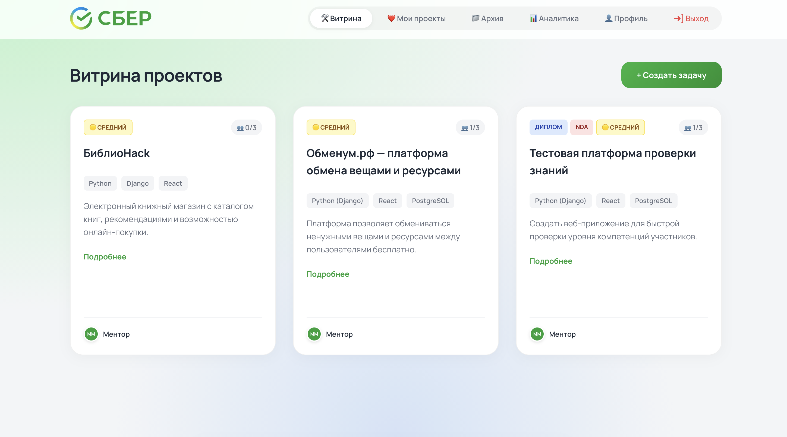
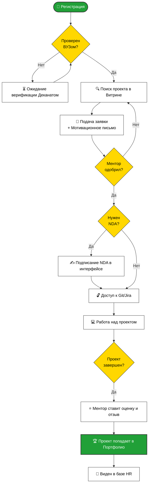
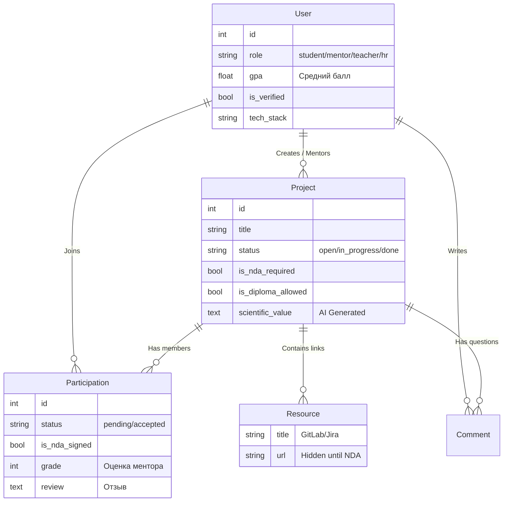

# 🚀 SberLab-NSU Hackathon Platform

**Платформа для управления совместными проектами СберЛаб и НГУ.**
Единая экосистема, объединяющая студентов, менторов из Сбера, преподавателей ВУЗа и HR-специалистов. Решает проблему коммуникации, бюрократии и поиска талантов.



## 💡 О проекте

Это не просто доска задач. Это ERP-система для управления полным жизненным циклом студенческих проектов: от идеи (сгенерированной AI) до трудоустройства в Сбер.

**Ключевые преимущества:**
*   **AI-ассистент (GigaChat):** Помогает менторам писать ТЗ и формулировать научную новизну для дипломов.
*   **Верификация ВУЗом:** Деканат подтверждает средний балл (GPA) студентов, исключая фейковые данные.
*   **Talent Pipeline для HR:** Аналитический дашборд для поиска лучших студентов по стеку и рейтингу.
*   **Юридическая безопасность:** Встроенный флоу подписания NDA и генерация документов (PDF).

---

## 🛠 Технологический стек

### Backend
*   **Язык:** Python 3.11
*   **Фреймворк:** Django + Django REST Framework
*   **AI:** GigaChat API (Сбер)
*   **База данных:** SQLite (для портативности) / PostgreSQL (Ready)
*   **Безопасность:** Token Authentication, CORS headers

### Frontend
*   **Core:** React, Vite
*   **UI/UX:** CSS Modules, Swiper (Галерея), React-Quill (Rich Text)
*   **Аналитика:** Recharts (Графики и диаграммы)
*   **PDF:** jsPDF (Генерация договоров)

### DevOps
*   **Контейнеризация:** Docker, Docker Compose
*   **Web Server:** Nginx (Reverse Proxy, Static files)

---

## 📐 Архитектура и Схемы

> *Здесь будут расположены блок-схемы, описывающие логику работы системы.*

### 1. Архитектура приложения (Container Diagram)
```mermaid
graph TD
    %% Стили
    classDef client fill:#f9f,stroke:#333,stroke-width:2px,color:black;
    classDef nginx fill:#21A038,stroke:#333,stroke-width:2px,color:white;
    classDef frontend fill:#61DAFB,stroke:#333,stroke-width:2px,color:black;
    classDef backend fill:#092E20,stroke:#333,stroke-width:2px,color:white;
    classDef db fill:#333,stroke:#333,stroke-width:2px,color:white;
    classDef ext fill:#ddd,stroke:#333,stroke-width:2px,stroke-dasharray: 5 5,color:black;

    User((👤 Пользователь)):::client
    GigaChat[🤖 GigaChat API]:::ext

    subgraph Docker_Compose [🐳 Docker Compose Host]
        direction TB
        
        subgraph Nginx_Container [Container: Nginx]
            Proxy[🔄 Reverse Proxy /80]:::nginx
            Static[📂 Static Files /dist]:::frontend
        end

        subgraph Backend_Container [Container: Django]
            API[⚙️ API Server /8000]:::backend
            Media[🖼️ Media Files]:::backend
        end

        DB[(🗄️ SQLite3 / File)]:::db
    end

    User -->|HTTP Request| Proxy
    Proxy -->|/ (Root)| Static
    Proxy -->|/api or /admin| API
    Proxy -->|/media| Media
    
    API -->|Read/Write| DB
    API -.->|JSON Request| GigaChat
```
*(Схема взаимодействия: Nginx -> React Static / Django API -> Database / GigaChat)*

### 2. Схема User Flow (Путь студента)

*(Регистрация -> Верификация -> Подача заявки -> Одобрение -> NDA -> Работа -> Оценка -> Портфолио)*

### 3. Схема БД (ER-Diagram)

*(Связи между Users, Projects, Participations, Comments)*

---

## 🐳 Запуск через Docker (Рекомендуемый)

Самый быстрый способ запустить проект для проверки жюри. Требуется установленный **Docker Desktop**.

1.  **Скачайте проект и перейдите в папку:**
    ```bash
    git clone https://gitlab.sberlab.nsu.ru/s.mariskin/sberlab_hack/
    cd sberlab_hack
    ```

2.  **Запустите контейнеры:**
    В проекте уже настроен `docker-compose.yml`, который подтянет готовые образы.
    ```bash
    docker-compose up
    ```
    *Первый запуск может занять 1-2 минуты.*

3.  **Откройте в браузере:**
    Перейдите по адресу: **[http://localhost](http://localhost)**

4.  **Остановка:**
    Нажмите `Ctrl+C` или выполните `docker-compose down`.

> **Примечание:** База данных с тестовыми пользователями и проектами уже вшита в образ. Вам не нужно создавать пользователей вручную.

---

## 👨‍💻 Запуск вручную (Для разработки)

Если вы хотите запустить проект локально без Докера.

### Предварительные требования
*   Python 3.11+
*   Node.js 20+ (обязательно для Vite 6)

### 1. Запуск Backend

```bash
# Переходим в папку бэкенда
cd backend

# Создаем и активируем виртуальное окружение
python -m venv venv
source venv/bin/activate  # Для Mac/Linux
# venv\Scripts\activate   # Для Windows

# Устанавливаем зависимости
pip install -r requirements.txt

# Применяем миграции
python manage.py migrate

# Запускаем сервер
python manage.py runserver
```
Бэкенд будет доступен по адресу: `http://127.0.0.1:8000`

### 2. Запуск Frontend

```bash
# В новом терминале переходим в папку фронтенда
cd frontend/frontend

# Устанавливаем зависимости
npm install

# Запускаем режим разработки
npm run dev
```
Фронтенд будет доступен по адресу: `http://localhost:5173`

---

## 🧪 Тестовые данные (Credentials)

Для удобства проверки в базе уже созданы пользователи с разными ролями:

| Роль | Логин | Пароль        | Описание |
| :--- | :--- |:--------------| :--- |
| **Admin** | `admin` | `admin`       | Полный доступ (Django Admin) |
| **Ментор** | `mentor` | `Aa12345678!` | Создание проектов, управление командой |
| **Студент** | `student` | `Aa12345678`         | Подача заявок, портфолио |
| **HR** | `hr` | `Aa12345678`         | Доступ к Talent Pool и аналитике |
| **Деканат** | `teacher` | `Aa12345678`         | Верификация студентов |

---

## 🌟 Основной функционал (Фичи)

1.  **Капитанская рубка (Ментор):**
    *   Визуализация команды слотами (как в лобби игр).
    *   Управление жизненным циклом проекта (Запуск, Пауза, Архив).
    *   Добавление скрытых ресурсов (ссылки на GitLab/Jira), доступных только после NDA.

2.  **AI-Генерация:**
    *   Нажмите "Создать проект" -> введите идею -> нажмите "🪄 Заполнить".
    *   GigaChat сгенерирует название, стек, описание и научную новизну.

3.  **Аналитика:**
    *   Красивые графики Recharts: популярность технологий, воронка статусов проектов.
    *   KPI метрики лаборатории.

4.  **Безопасность и Валидация:**
    *   Студент не может сам себе "нарисовать" оценки. Только роль `teacher` может подтвердить GPA.
    *   Студент не видит ссылок на код, пока не нажмет "Подписать NDA".

---
